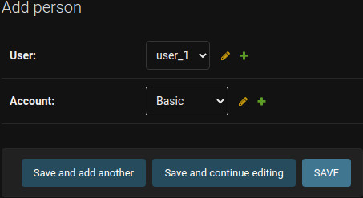

# Django Rest Api - Image

The application allows any user to upload an image in PNG or JPG format on API. The application using Django REST framework. User in answer get links to an image. Amount of links depends on user's plan.


<dl>
Plans:

* Basic:
    - a link to a thumbnail that's 200px in height
* Premium :
    - a link to a thumbnail that's 200px in height
	- a link to a thumbnail that's 400px in height
	- a link to the originally uploaded image
* Enterprise:
    - a link to a thumbnail that's 200px in height
	- a link to a thumbnail that's 400px in height
	- a link to the originally uploaded image
    - a link that expires after a number of seconds (user can specify any number between 300 and 30000) - not yet implemented
<dl>
    
## Table of contents
* [Technologies](#technologies)
* [Installation](#installation)
* [Run & Setup](#run_&_setup)
* [Live Preview](#live_preview)


## Technologies

- Python 3.8.10
- Django 3.2.7
- Django REST framework
- Sorl Thumbnail Serializer Field
- Pytest

## Installation

The application requires Python, Django and Django REST framework to run. All required libraries have been placed in the file requirements.txt. The Application is open source with a [public repository][git-repo] on GitHub.

```sh
pip install -r requirements.txt
```

Performing the migration:
```sh
python manage.py migrate
```
## Run & Setup
Run application for developer environments...
```sh
python manage.py runserver
```

In the admin panel enter the settings and create required objects (User, Account, Person). Logging in is via the website admin panel 

```sh
www.example.com/admin/
```

<p align="center">
  
</p>


<dl>
  <dt>Create Account</dt>
    <dd> Make three plans: Basic, Premium, Enterprise. </dd>
    <p align="center">
        
    </p>

  <dt>Create Person</dt>
    <dd>Through the Person model, a user can be assigned an appropriate plan.</dd>
    <p align="center">
        
    </p>


  <dt>Sites settings</dt>
    <dd>You need to enter the domain you are using to create the links.</dd>
    <p align="center">
        
    </p>


</dl>

## Live Preview
The application can be used through the website [azawrotniak.pythonanywhere.com][pythonanywhere]. The following accounts have been created. Logging in is via the website [azawrotniak.pythonanywhere.com/admin][login].

<center>

| User   | Password      | Plan       |
| -------|:-------------:| :---------:|
| admin  | admin         | Premium    |
| user_1 | password_user1| Basic      |
| user_2 | password_user1| Premium    |
| user_3 | password_user1| Enterprise |

</center>

Upload an image in PNG or JPG format via the website [azawrotniak.pythonanywhere.com/upload_image][upload_image].
    <p align="center">
        
    </p>

Users can display their images via the website [azawrotniak.pythonanywhere.com/images][images].

<p align="center">
    
</p>


[git-repo]: <https://github.com/azawrotniak/rest_api_update_image>
[pythonanywhere]: <http://azawrotniak.pythonanywhere.com>
[login]: <http://azawrotniak.pythonanywhere.com/login>
[images]: <http://azawrotniak.pythonanywhere.com/images>
[upload_image]: <http://azawrotniak.pythonanywhere.com/upload_image>